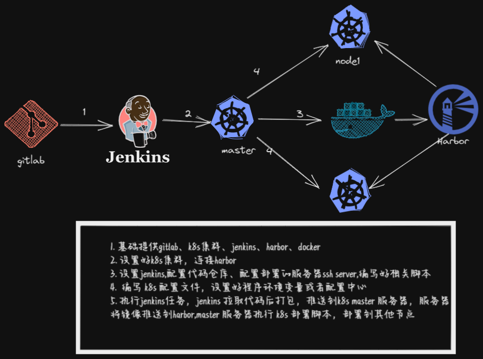
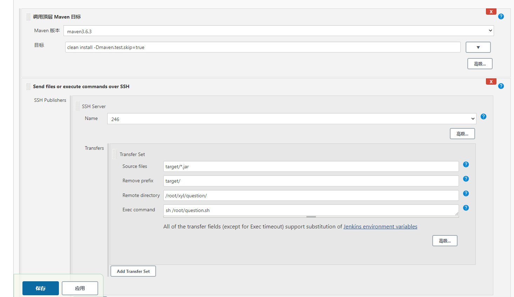
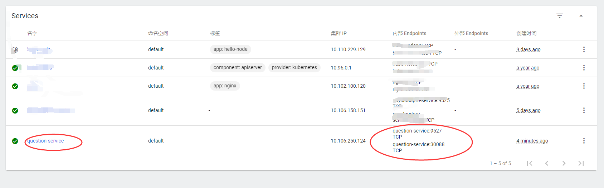

#### 准备工作

需要搭建k8s集群、harbor镜像仓库、jenkins,代码管理使用自建gitlab 、gitee、github都可以。

大体流程如下：

1. jenkins 从代码仓库拉取代码，打包上传到k8s  master 节点（此处为了方便）

2. master节点将镜像推送到自己搭建的 harbor仓库

3. 推送完，master节点执行部署命令，创建 deployment和service  部署

#### 后端准备

后端配置全部改为变量，如下简单示例：

```
spring:
  profiles:
    active: ${activeprofile}
```

activeprofile 到时从 k8s  配置指定

数据库：

```
 datasource:
        master:
          username: root
          password: 123456
          driver-class-name: net.sf.log4jdbc.sql.jdbcapi.DriverSpy
          url: jdbc:log4jdbc:mysql://${MYSQLSERVER}:${MYSQLPORT}/psycloudpro?serverTimezone=Asia/Shanghai&characterEncoding=utf8&useSSL=false
```

redis:

```
 redis:
    host: ${REDISSERVER}
    port: ${REDISPORT}
    database: 0
    password:
    timeout: 10
```

然后，将代码推送至 gitlab仓库

#### 配置k8s yml

```yml
apiVersion: v1
kind: Service
metadata:
  name: question-service
spec:
  type: NodePort
  ports:
    - port: 9527
      targetPort: 9527
      nodePort: 30088
  selector:
    name: question
---
apiVersion: apps/v1
kind: Deployment
metadata:
  name: question-d
spec:
  selector:
    matchLabels:
      name: question
  replicas: 2 # 2实例集群
  template:
    metadata:
      labels:
        name: question
    spec:
      containers:
        - name: question
          image: docker.soulhappy.com/soulhappy/question:latest # harbor镜像  地址，本地改了 host  文件
          imagePullPolicy: Always
          ports:
            - containerPort: 9527
          env:
          - name: activeprofile
            value: "prod"
          - name: MYSQLSERVER
            value: 192.168.10.75
          - name: MYSQLPORT
            value: "3306"
          - name: REDISSERVER
            value: 192.168.10.245
          - name: REDISPORT
            value: "6379"

```

#### 配置部署脚本

脚本和上面的yml  都放到 自己 master  服务器的目录下，以便 jenkins  调用

```shell
#!/bin/sh
cd /root/xyl/question
docker build -t docker.soulhappy.com/soulhappy/question:latest .
docker push docker.soulhappy.com/soulhappy/question:latest
echo "push success"
cd /root/
kubectl delete -f question.yml
kubectl apply -f question.yml
echo "deploy success"
exit 1
```

#### jenkins 配置

新建任务，配置好仓库地址，然后增加两个构建步骤

1. 调用 maven  顶层目标
2.  send file  or  execute commands  over ssh




保存任务后，点击构建

#### 访问服务

可以通过 k8s  dashboard  查看 service  状态




或者通过 30088 端口访问服务